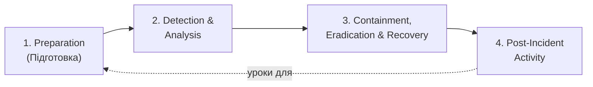

# 16.8. Incident Response всередині SOC

## Де IR Playbooks з Модуля 07 живуть операційно

Модуль 07 дав перше, оглядове знайомство з IR Playbooks для ransomware й фішингу. Цей розділ показує, як реагування на інциденти інтегрується в **щоденну операційну структуру SOC**, розглянуту в розділах 16.1-16.7: хто саме виконує кожен крок, з якими інструментами, і як це узгоджується з ярусною моделлю (розділ 16.2).

## Фази реагування на інциденти в контексті SOC

Класична модель NIST SP 800-61 (Computer Security Incident Handling Guide) визначає чотири фази, які тепер можна прив'язати до конкретних ролей і інструментів SOC:

1. **Preparation (Підготовка)** — задокументовані Playbooks (розділ 16.4), навчена команда (розділ 16.2), налаштовані інструменти (SIEM/SOAR, розділи 16.3-16.4), визначені контакти й канали ескалації — все, що описано в розділах 16.1-16.7, є частиною цієї фази.
2. **Detection & Analysis (Виявлення й аналіз)** — Tier 1 первинна тріаж, Tier 2 поглиблене розслідування (розділ 16.2), з опорою на SIEM-кореляцію (16.3) і, за потреби, ручний Threat Hunting-аналіз (16.5) для нестандартних випадків.
3. **Containment, Eradication & Recovery (Стримування, усунення, відновлення)** — SOAR автоматизує первинне стримування (16.4); повне усунення кореневої причини (наприклад, патчинг вразливості, що дозволила початковий доступ, Модуль 12) і відновлення (пряме застосування DRP з Модуля 13, розділ 13.10) — часто виходить за межі самого SOC, залучаючи IT-операції чи власників систем.
4. **Post-Incident Activity (Дії після інциденту)** — «lessons learned» сесія, оновлення Playbooks і SIEM-правил на основі знайденого (замикаючи цикл до Preparation), формальне звітування (розділ 16.7 метрики, Модуль 15 GRC-звітність), і, за застосовності, обов'язкове інформування CERT-UA (Модуль 15, розділ 15.7) для об'єктів критичної інфраструктури.

## Severity-класифікація: не всі інциденти рівнозначні

За аналогією з класифікацією ризиків (Модуль 13, розділ 13.5) і Non-Conformities аудиту (Модуль 15, розділ 15.4), інциденти класифікуються за тяжкістю для визначення відповідного рівня ескалації й терміновості реакції:

| Рівень | Приклад | Типова реакція |
|---|---|---|
| **P1 / Critical** | Активне поширення ransomware, підтверджена ексфільтрація даних клієнтів | Негайна ескалація до Tier 3 та керівництва, активація повного IR Playbook, можливе залучення зовнішніх експертів (форензика) |
| **P2 / High** | Компрометований обліковий запис з обмеженим доступом, зупинена на ранньому етапі | Ескалація до Tier 2, стандартний Playbook, стримування протягом години |
| **P3 / Medium** | Ізольована спроба фішингу без успішної компрометації | Обробка Tier 1/2 за стандартним runbook, документування без екстреної ескалації |
| **P4 / Low** | Поодинокий False Positive, підозріла, але пояснена активність | Закриття Tier 1, можливе оновлення правила для зниження шуму |

## Комунікація під час інциденту: технічна й управлінська паралель

Розділ реагування на інциденти всередині SOC прямо перетинається з BCP (Модуль 13, розділ 13.10): комунікаційний план під час P1-інциденту визначає не лише технічні кроки, а й хто, кого і коли інформує — від технічної команди до керівництва (Модуль 15, розділ 15.2, Leadership) і, за необхідності, до зовнішніх сторін (клієнти, регулятори, CERT-UA). SOC-аналітик Tier 2/3, що веде технічне розслідування, зазвичай не є тією самою особою, що комунікує з керівництвом чи пресою — чітке розділення технічної й комунікаційної ролей запобігає як витоку неперевіреної інформації назовні, так і перевантаженню технічного персоналу невластивими задачами в критичний момент.

> **Міні-вправа 16.8.1:** Під час активного P1-інциденту (підозра на ransomware, що поширюється мережею) Tier 2-аналітик, зайнятий технічним стримуванням, отримує прямий дзвінок від журналіста, що якимось чином дізнався про інцидент, з проханням прокоментувати ситуацію. Яка правильна дія аналітика, і чому це не питання особистої комунікаційної майстерності, а структурна проблема процесу?
>
> 

Відповідь

>
> Правильна дія - ввічливо відмовитися коментувати й перенаправити журналіста до заздалегідь визначеної контактної особи для зовнішньої комунікації (типово PR/юридичний відділ чи керівництво, а не технічний персонал SOC), одночасно негайно повідомивши свого керівника про факт витоку інформації про інцидент назовні. Це структурна, а не особиста проблема: Preparation-фаза (перша з чотирьох фаз IR) має заздалегідь визначити єдину точку контакту для зовнішньої комунікації саме для запобігання ситуації, коли технічний спеціаліст, зосереджений на стримуванні загрози, змушений імпровізувати публічний коментар під тиском - ризик неточної, юридично необережної заяви (з наслідками для юридичного захисту, Модуль 13, розділ 13.1) значно вищий, коли комунікаційна роль не розділена заздалегідь.
> 

## Зв'язок з форензикою

Для P1/P2-інцидентів, що потенційно вимагають юридичного переслідування зловмисника чи глибшого розуміння повного обсягу компрометації, SOC-розслідування передає естафету поглибленій цифровій криміналістиці (chain of custody, дискова й пам'яттєва форензика) — тема, що виходить за межі оперативного реагування SOC у власному розумінні цього модуля й вимагає спеціалізованої експертизи, доповнюючи, а не замінюючи описаний тут SOC-процес.

---

**Попередній розділ:** [16.7. Метрики та зрілість SOC](07-metryky-ta-zrilist-soc.md)
**Наступний розділ:** [16.9. Побудова SOC: In-house, MSSP, Hybrid](09-pobudova-soc-modeli.md)
**Назад до модуля:** [README модуля 16](README.md)
