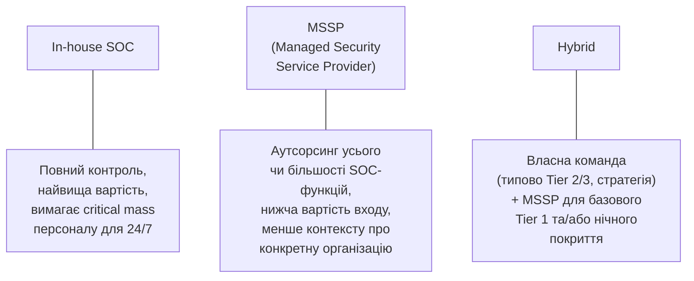

# 16.9. Побудова SOC: In-house, MSSP, Hybrid

## Хто фізично виконує все, розглянуте в розділах 16.1-16.8

Останнє практичне запитання перед лабораторною й підсумком: чи будувати весь описаний апарат (SIEM, SOAR, ярусна модель аналітиків, Threat Hunting) власними силами організації, чи передати частину чи все зовнішньому постачальнику? Це рішення прямо повторює логіку принципу пропорційності, наскрізного для всього посібника (контекст завдання на початку) — правильна відповідь залежить від розміру, ресурсів і риск-профілю конкретної організації, а не є універсальною.

## Три моделі

### In-house SOC

Організація будує повний SOC власними силами: наймає аналітиків усіх рівнів (розділ 16.2), купує й адмініструє SIEM/SOAR (розділи 16.3-16.4), розвиває власну Threat Hunting-експертизу (розділ 16.5).

- **Переваги:** повний контроль над процесами й пріоритетами; глибокий, накопичуваний контекст про специфіку власної інфраструктури (найцінніший актив досвідченого SOC-аналітика — знання «нормальної» поведінки саме цієї мережі, що дозволяє швидше розпізнавати аномалії); відсутність залежності від зовнішнього постачальника для критичної функції безпеки.
- **Недоліки:** висока вартість входу (потрібна критична маса персоналу навіть для мінімального 24/7-покриття, розділ 16.2); тривалий час на досягнення операційної зрілості (розділ 16.7); ризик втрати ключових співробітників (аналогічно ризику плинності кадрів, розглянутому в Модулі 13, розділ 13.7, і в розділі 16.2 цього модуля).

### MSSP (Managed Security Service Provider)

Зовнішній постачальник надає SOC-функції як послугу: моніторинг, первинну тріаж, іноді повне реагування, за контрактом з визначеним SLA.

- **Переваги:** швидкий старт (немає потреби будувати інфраструктуру й наймати команду з нуля); нижча вартість входу для малих і середніх організацій; постачальник обслуговує багатьох клієнтів одночасно, накопичуючи ширшу Threat Intelligence (розділ 16.6) з різних джерел, потенційно раніше помічаючи нові кампанії.
- **Недоліки:** менший контекст про специфіку конкретної організації (типова причина довшого MTTD/MTTR, розділ 16.7, порівняно з добре налагодженим in-house SOC); залежність від якості й доступності зовнішнього постачальника — пряме застосування логіки Vendor Risk Tiering (Модуль 15, розділ 15.10) до самого постачальника SOC-послуг як критичного вендора.

### Hybrid (Гібридна модель)

Найпоширеніший практичний компроміс для організацій середнього розміру: власна невелика команда (типово Tier 2/3, зосереджена на стратегії, найкритичніших активах і накопиченні внутрішнього контексту) поєднується з MSSP для базового Tier 1 моніторингу й/або покриття неробочих годин (аналогічно моделі Follow-the-Sun чи змінного покриття з розділу 16.2, але з залученням зовнішнього партнера замість власної нічної зміни).

> **Міні-вправа 16.9.1:** Стартап на 30 співробітників з обмеженим бюджетом безпеки, що обробляє нечутливі дані (низька класифікація критичності за Модулем 13, розділ 13.3), розглядає побудову повноцінного in-house SOC із власною ярусною моделлю аналітиків. Спираючись на принцип пропорційності, яка модель, найімовірніше, економічно обґрунтованіша на цьому етапі, і яка альтернатива взагалі можлива для дуже малої організації?
>
> 

Відповідь

>
> In-house SOC із повною ярусною моделлю (розділ 16.2) для 30-особової компанії з низьким профілем ризику - непропорційна інвестиція: критична маса персоналу для навіть мінімального 24/7-покриття (кілька аналітиків на кожен ярус з урахуванням змін і відпусток) суттєво перевищує реальну потребу організації такого масштабу, аналогічно тому, як стартап з Модуля 15 (розділ 15.5, міні-вправа 15.5.1) не повинен прагнути NIST CSF Tier 4 негайно. Економічно обґрунтованіша модель - MSSP (базовий моніторинг за розумний щомісячний контракт) чи навіть, для дуже малої організації з мінімальним ризиком, часткове покриття через вбудовані можливості хмарного провайдера (наприклад, нативні security-сервіси AWS/Azure, уже частково автоматизовані) без повноцінного окремого SOC-контракту взагалі - той самий принцип пропорційності, застосований до вибору моделі SOC, а не лише до глибини технічних контролів.
> 

## Гібридна модель на практиці: розподіл відповідальності

| Функція | In-house команда | MSSP |
|---|---|---|
| Tier 1 первинна тріаж (24/7) | — | Так (основне навантаження MSSP) |
| Tier 2/3 поглиблене розслідування критичних інцидентів | Так | Ескалація до in-house за потреби |
| Стратегічний Threat Hunting (16.5) | Так (найкращий контекст про власну інфраструктуру) | Опційно, як додаткова послуга |
| Написання й підтримка SIEM Use Cases (16.3) | Так (спільно з MSSP) | Базовий набір стандартних правил |
| GRC-звітність керівництву (Модуль 15) | Так | Постачає сирі метрики, не інтерпретацію для керівництва |

## Оцінка вартості MSSP: SLA як ключовий контрактний елемент

Обираючи MSSP, організація застосовує ту саму логіку due diligence постачальника, що й Модуль 15 (розділ 15.10): перевірка сертифікатів MSSP (ISO 27001, SOC 2), контрактні гарантії SLA щодо конкретних метрик (гарантований MTTD/MTTR, розділ 16.7, а не розпливчасті обіцянки «швидкого реагування»), право на аудит якості наданих послуг, і чіткий процес ескалації, коли MSSP виявляє щось, що вимагає рішення власної команди клієнта (наприклад, P1-інцидент, розділ 16.8, що потребує бізнес-рішення про сплату викупу за ransomware чи публічне розкриття, — рішення, яке MSSP фізично не може прийняти замість керівництва клієнта).

---

**Попередній розділ:** [16.8. Incident Response всередині SOC](08-incident-response-v-soc.md)
**Наступний розділ:** [16.10. Практична лабораторна на Python](10-praktychna-laboratorna.md)
**Назад до модуля:** [README модуля 16](README.md)
