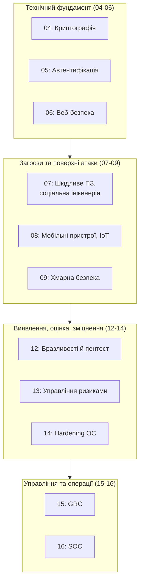

# 16.12. Завершення курсу: синтез 16 модулів

## Шлях від першого модуля до цього рядка

Цей посібник розпочався з фундаментальних понять кібербезпеки — CIA-тріади, типів зловмисників, базової формули ризику. Шістнадцять модулів по тому він завершується операційним середовищем SOC, де ці самі поняття застосовуються щодня, під тиском реального часу, проти реальних супротивників. Варто витратити цей завершальний розділ на те, щоб побачити не 16 окремих тем, а одну зв'язну картину.

## Карта посібника: чотири великі блоки

*(Модулі 10-11 — мережева безпека та поглиблена форензика — заплановані, але не входять до поточного завершеного циклу; нумерація модулів 04-16 відображає фактично написаний матеріал.)*

- **Технічний фундамент (04-06)** відповів на запитання «як побудувати захищену систему з нуля»: шифрування даних, надійна автентифікація, безпечний веб-застосунок.
- **Загрози та поверхні атаки (07-09)** показав, звідки саме приходить небезпека: шкідливе ПЗ й маніпуляція людьми, мобільні й IoT-пристрої, хмарна інфраструктура — кожна зі своєю специфікою.
- **Виявлення, оцінка, зміцнення (12-14)** дав систематичний, повторюваний процес: знаходити слабкості (Модуль 12), вирішувати, які з них найважливіші (Модуль 13), і приводити системи до безпечного стану (Модуль 14).
- **Управління та операції (15-16)** підняв усе це на організаційний рівень: формалізована, сертифікована система управління (Модуль 15) і щоденне операційне середовище, де вона реалізується в реальному часі (Модуль 16).

## Наскрізні принципи, що повторювалися в кожному блоці

Якщо є один урок, який мав би залишитися після проходження всього посібника, це не конкретна технологія (вони застаріють) чи конкретний стандарт (вони оновлюються), а кілька принципів, що проявлялися знову й знову під різними іменами:

- **Пропорційність.** Level 1 проти Level 2 CIS Benchmarks (Модуль 14); NIST CSF Tier, відповідний реальному ризику, а не максимальний завжди (Модуль 15); вибір моделі SOC відповідно до розміру організації (Модуль 16). Безпека — не про максимум контролю всюди, а про контроль, пропорційний реальному ризику.
- **Профілактика недостатня без виявлення, виявлення недостатнє без реагування.** Patch Management без сканування — реагування наосліп; сканування без патчування — марне знання (Модуль 12). SIEM без SOAR — сповіщення без дії; SOAR без SIEM — дія без якісного сигналу (Модуль 16). Кожен модуль показував варіацію того самого уроку.
- **Залишковий ризик, а не нульовий ризик.** Жоден контроль не знижує ризик до нуля (Модуль 13) — мета управління безпекою не «усунути весь ризик» (неможливо), а свідомо, обґрунтовано керувати тим, що залишається.
- **Людське судження понад автоматизацію, а не замість неї.** Compliance as Code (Модуль 15) і SOAR-автоматизація (Модуль 16) прискорюють рутинні рішення, але критичні, неоднозначні випадки завжди повертаються до людини з контекстом і відповідальністю.
- **Документована відповідальність понад мовчазне припущення.** Власники активів (Модуль 13), власники ризиків (Модуль 13), обґрунтована незастосовність контролю в SoA (Модуль 15) — безпека, що спирається на «хтось, напевно, цим займається», систематично провалюється саме в момент реального інциденту.
- **Реальний український контекст, а не абстрактна теорія.** CERT-UA, Kyivstar 2023, NotPetya, HermeticWiper, ДСТУ-стандарти, ЗУ «Про основні засади забезпечення кібербезпеки» — кожен модуль намагався заземлити міжнародні концепції в конкретну, актуальну реальність, а не залишати їх абстрактними міжнародними прикладами, відірваними від контексту, де цей посібник читається.

## Куди рухатися далі

Цей посібник вирівняний зі структурою **ISC2 Certified in Cybersecurity (CC)** та **Cisco CyberOps Associate** — двох визнаних, доступних сертифікацій початкового й проміжного рівня, що формально підтверджують знання, охоплені цими 16 модулями. Практичні наступні кроки для читача, що дійшов до цього рядка:

1. **Формальна сертифікація** — ISC2 CC як точка входу, Cisco CyberOps Associate для більш SOC-орієнтованого підтвердження (прямо відповідає Модулю 16), з подальшим рухом до CompTIA Security+, а згодом — до спеціалізованих сертифікацій (OSCP для пентесту, Модуль 12; CISSP для управлінського треку, Модулі 13/15).
2. **Практика на CTF-платформах і лабораторних середовищах** — теорія цього посібника набуває глибини лише через реальну, руки-на-клавіатурі практику: власна лабораторія (Модуль 14), CTF-змагання (техніки з Модуля 12), participation у програмах Bug Bounty (Модуль 12, розділ 12.10) під легітимними правилами.
3. **Спільнота й безперервне навчання.** Кіберзагрози еволюціонують швидше за будь-який друкований (чи навіть регулярно оновлюваний) посібник — підписка на CERT-UA, участь у галузевих ISAC (Модуль 13), слідкування за MITRE ATT&CK-оновленнями (Модуль 07) — практики безперервного навчання, які жоден курс не замінює одноразово.
4. **Внесок назад у спільноту.** Практики responsible disclosure (Модуль 12), участь у Purple Team-вправах (Модуль 12), менторство наступного покоління фахівців — кібербезпека, зрештою, колективна дисципліна: захист однієї організації робить складнішими масові атаки на всіх інших.

## Останнє слово

Шістнадцять модулів тому цей посібник почався з простого твердження: кібербезпека — не про досягнення ідеального, непроникного захисту (такого не існує), а про систематичне, обґрунтоване управління ризиком у світі, де досконалості не буде ніколи. Кожен наступний модуль додавав ще один шар до цього управління — технічний, операційний, управлінський — але жоден з них не робив систему бездоганною. Це не недолік посібника, а чесне відображення природи самої дисципліни. Компетентний фахівець з кібербезпеки — не той, хто гарантує, що нічого не станеться, а той, хто систематично знижує ймовірність і вплив того, що зрештою станеться, і будує організацію, здатну гідно й швидко відповісти, коли це відбудеться.

---

**Попередній розділ:** [16.11. Чек-лист і самоперевірка](11-chek-lyst-i-samoperevirka.md)
**Назад до модуля:** [README модуля 16](README.md)
**Це завершальний розділ курсу з 16 модулів.**
